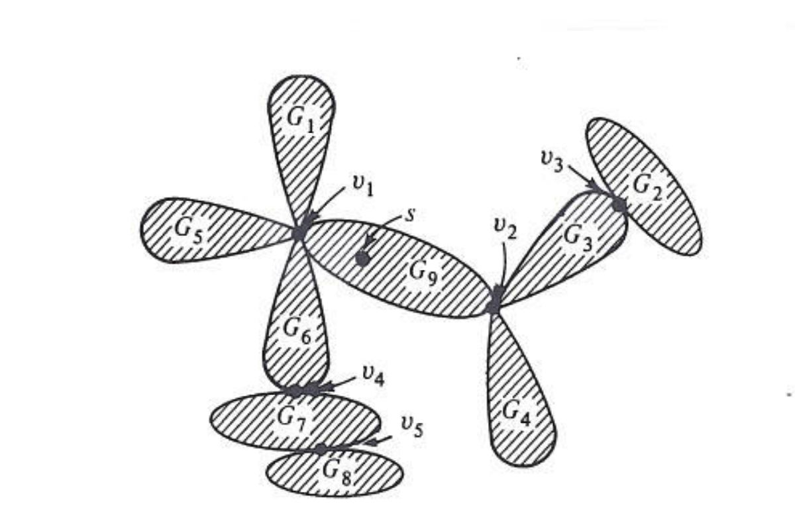

## Description
https://en.wikipedia.org/wiki/Biconnected_component

Hopcroft and Tarjan present [a DFS based algorithm](http://akira.ruc.dk/~keld/teaching/algoritmedesign_f03/Artikler/06/Hopcroft73.pdf) to find biconnected component. However the paper didn't prove it. Here is [a proof by Reingold](https://www.cs.cmu.edu/~avrim/451f12/lectures/biconnected.pdf). The following animation shows the order that we discover each biconnected components separated by articulation points via this DFS algorithm. The reason why we use DFS/ function stack is to maintain an order so as to handle each biconnected components one by one.

All Hamiltonian graphs are biconnected, but a biconnected graph need not be Hamiltonian (see, for example, the Petersen graph).[[6]](https://en.wikipedia.org/wiki/Hamiltonian_path#cite_note-6)

## Difference with Strong Connected Components
Biconnected components is the graph in which components won't increase if any one vertex is removed. Strong connected components is the graph in which every node is reachable to every other node. For example, the following graph is not biconnected, but it is strong conntected.

