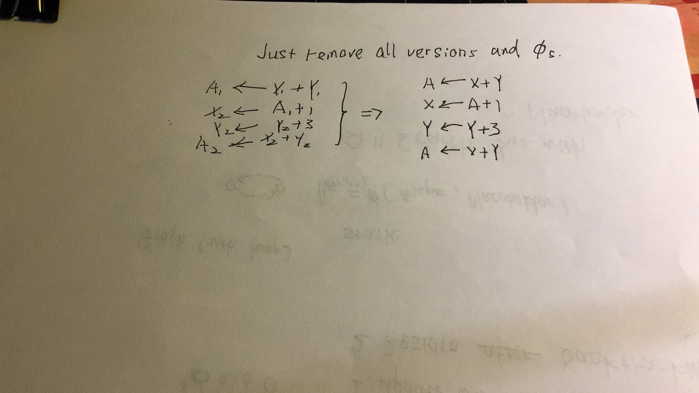

## Immutable

Single static assignment can be viewed as an application of immutable. As illustrated in the following example.

```
A1 <- X1 + Y1
...
B1 <- X1 + Y1
```

Since we know the X1 and Y1 are immutable which can't be modified by the instructions between these two. We can tell A1 and B1 are equivalent very easily.

## Paper : Global Value Numbers and Redundant Computations

### Questions
* How to transform to SSA form?


* How to transform back from SSA form? 



* How to know in each iteration we improve the code?
