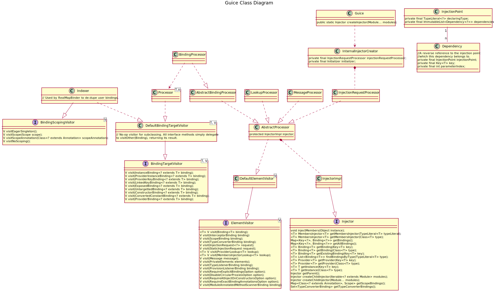

Phases to create Injectors from modules.
```
grep stopwatch.resetAndLog -r .
./core/src/com/google/inject/internal/InternalInjectorCreator.java:    stopwatch.resetAndLog("Injector construction");
./core/src/com/google/inject/internal/InternalInjectorCreator.java:    stopwatch.resetAndLog("Binding initialization");
./core/src/com/google/inject/internal/InternalInjectorCreator.java:    stopwatch.resetAndLog("Binding indexing");
./core/src/com/google/inject/internal/InternalInjectorCreator.java:    stopwatch.resetAndLog("Collecting injection requests");
./core/src/com/google/inject/internal/InternalInjectorCreator.java:    stopwatch.resetAndLog("Binding validation");
./core/src/com/google/inject/internal/InternalInjectorCreator.java:    stopwatch.resetAndLog("Static validation");
./core/src/com/google/inject/internal/InternalInjectorCreator.java:    stopwatch.resetAndLog("Instance member validation");
./core/src/com/google/inject/internal/InternalInjectorCreator.java:    stopwatch.resetAndLog("Provider verification");
./core/src/com/google/inject/internal/InternalInjectorCreator.java:    stopwatch.resetAndLog("Delayed Binding initialization");
./core/src/com/google/inject/internal/InternalInjectorCreator.java:    stopwatch.resetAndLog("Static member injection");
./core/src/com/google/inject/internal/InternalInjectorCreator.java:    stopwatch.resetAndLog("Instance injection");
./core/src/com/google/inject/internal/InternalInjectorCreator.java:    stopwatch.resetAndLog("Preloading singletons");
./core/src/com/google/inject/internal/InjectorShell.java:      stopwatch.resetAndLog("Module execution");
./core/src/com/google/inject/internal/InjectorShell.java:      stopwatch.resetAndLog("Interceptors creation");
./core/src/com/google/inject/internal/InjectorShell.java:      stopwatch.resetAndLog("TypeListeners & ProvisionListener creation");
./core/src/com/google/inject/internal/InjectorShell.java:      stopwatch.resetAndLog("Scopes creation");
./core/src/com/google/inject/internal/InjectorShell.java:      stopwatch.resetAndLog("Converters creation");
./core/src/com/google/inject/internal/InjectorShell.java:      stopwatch.resetAndLog("Binding creation");
./core/src/com/google/inject/internal/InjectorShell.java:      stopwatch.resetAndLog("Module annotated method scanners creation");
./core/src/com/google/inject/internal/InjectorShell.java:      stopwatch.resetAndLog("Private environment creation");
```
# Class Diagram


In [InjectionImpl](https://github.com/google/guice/blob/master/core/src/com/google/inject/internal/InjectorImpl.java#L1046-L1058) there is a dependency stack to recursivly handle dependencies when creating new instances.
