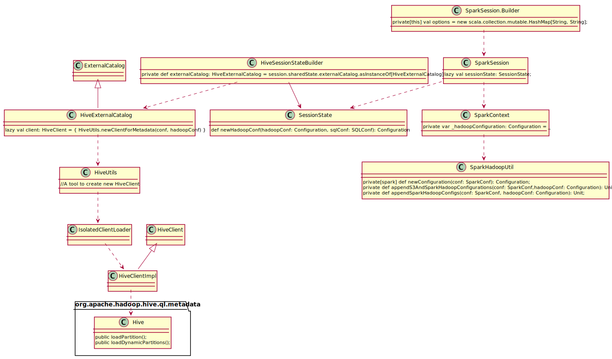

**Question**: When and where to set `fs.file.impl.disable.cache`? [Here](https://code.amazon.com/reviews/CR-3997642/revisions/2#/diff) are some trials but why the prefixed version `spark.hadoop.fs.file.impl.disable.cache` doesn't work? Why sometimes changing `fs.file.impl`'s value do alter the behavior, but sometimes it doesn't?

**Answer**: Spark talks to Hive Metastore to manipulates tables stored in it and uses class _HiveClient_ to communicate with Hive metastore. At the first time when _spark.sql()_ or equivalent is invoked, the lazy val SessionState will be initialized. During the initialization of SessionState, HiveClient will be created and maintains an internal HiveConf. So there is only one chance to change metastore related behavior. In comparison, _JobConf_ generated by the function _SessionState.newHadoopConf()_ will merge with current _sqlConf_ configs so that some configs can alter system behavior at runtime. 
 
Here is the [call stack](https://pastebin.com/raw/K3ecM2zr) and the [class diagram](https://pastebin.com/raw/0yWjWEqz).

The prefix version won't work since package spark-testing-base initializes a [SharedSparkContext](https://github.com/holdenk/spark-testing-base/blob/master/src/main/pre-2.0/scala/com/holdenkarau/spark/testing/SharedSparkContext.scala) before we could apply our prefixed config into it. However the unprefixed config works the same since [configs in sparkConf](https://github.com/apache/spark/blob/master/sql/hive/src/main/scala/org/apache/spark/sql/hive/client/HiveClientImpl.scala#L171) will also be populated into the HiveConf.

