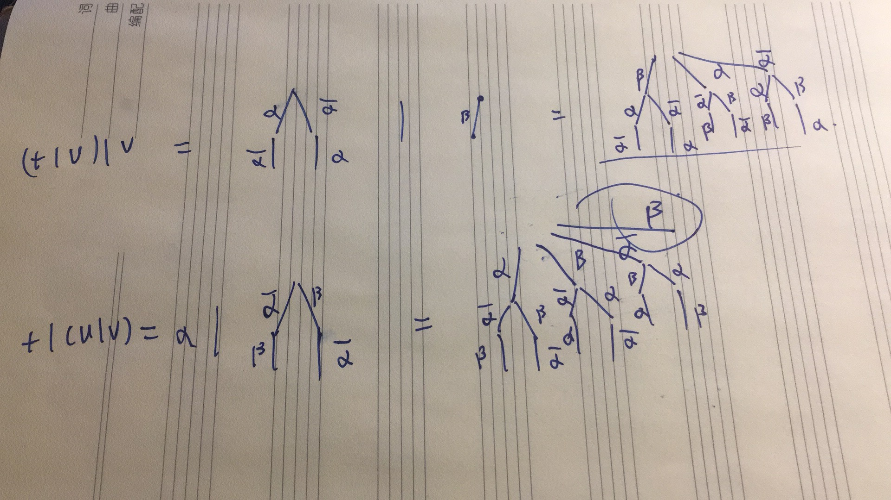

# Reading text
Milner, Robin. "A calculus of communicating systems." LNCS 92 (1980). [link](https://drive.google.com/open?id=1LGxFKD2nyv0nLDIVYzSZNhcVTg1CdTJP)

# Solutions to some excercises

__Excercise 2.4__: we can prove in this new definition t|(u|v) contains a branch B, but (t|u)|v doesn't. 

